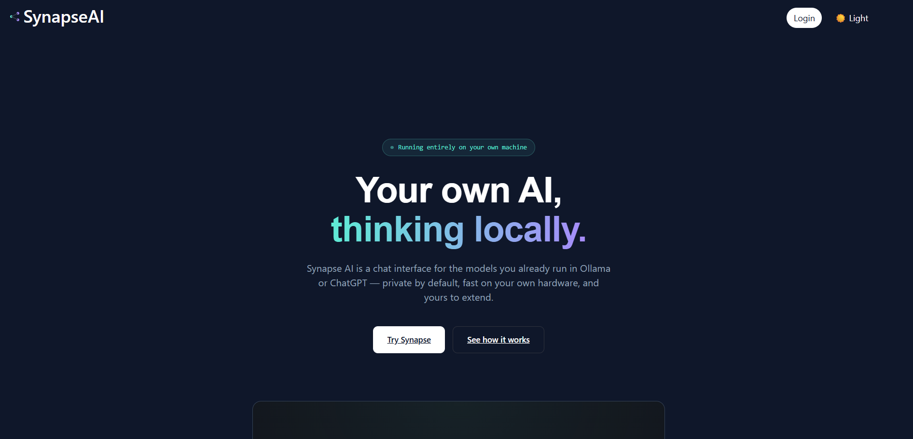
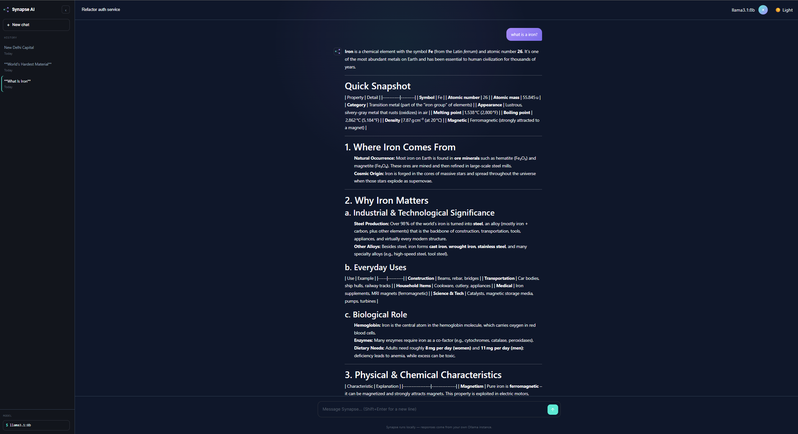
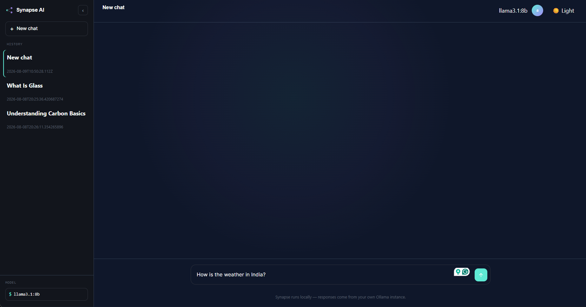

# Synapse UI

## Command to Create App
    npm create vite@latest my-app -- --template react-ts

## Snapshots
### Conversations
  <video width="640" controls poster="snapshots/new_chat.png">
    <source src="snapshots/SynapseAI.mp4" type="video/mp4">
    Your browser does not support the video tag. Download the video: [SynapseAI.mp4](snapshots/SynapseAI.mp4)
  </video>

### Dashboard
  
### Chats
  
# React + TypeScript + Vite
### Chats
  
# React + TypeScript + Vite

## ENV Files
VITE_GOOGLE_CLIENT_ID
VITE_SYNAPSE_URL
VITE_TIMEOUT

## To Deploy Kubernetes
  kubectl apply -f deployment.yml
  minikube image load aariskazi/synapse-ui:v2
  kubectl rollout restart deployment synapse-ui
  kubectl get svc
  minikube service synapse-ui-service --url
  kubectl get endpoints synapse-ui-service

This template provides a minimal setup to get React working in Vite with HMR and some ESLint rules.

Currently, two official plugins are available:

- [@vitejs/plugin-react](https://github.com/vitejs/vite-plugin-react/blob/main/packages/plugin-react) uses [Oxc](https://oxc.rs)
- [@vitejs/plugin-react-swc](https://github.com/vitejs/vite-plugin-react/blob/main/packages/plugin-react-swc) uses [SWC](https://swc.rs/)
